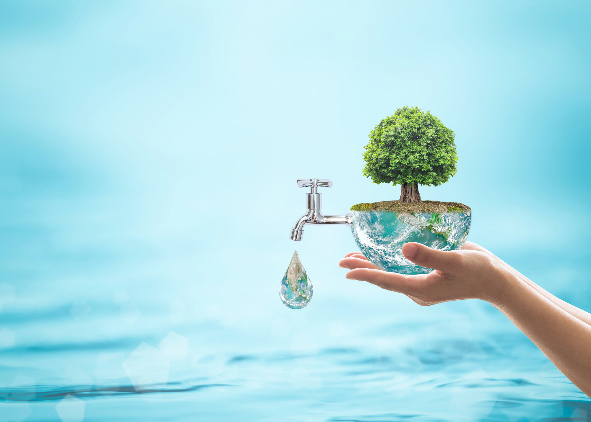
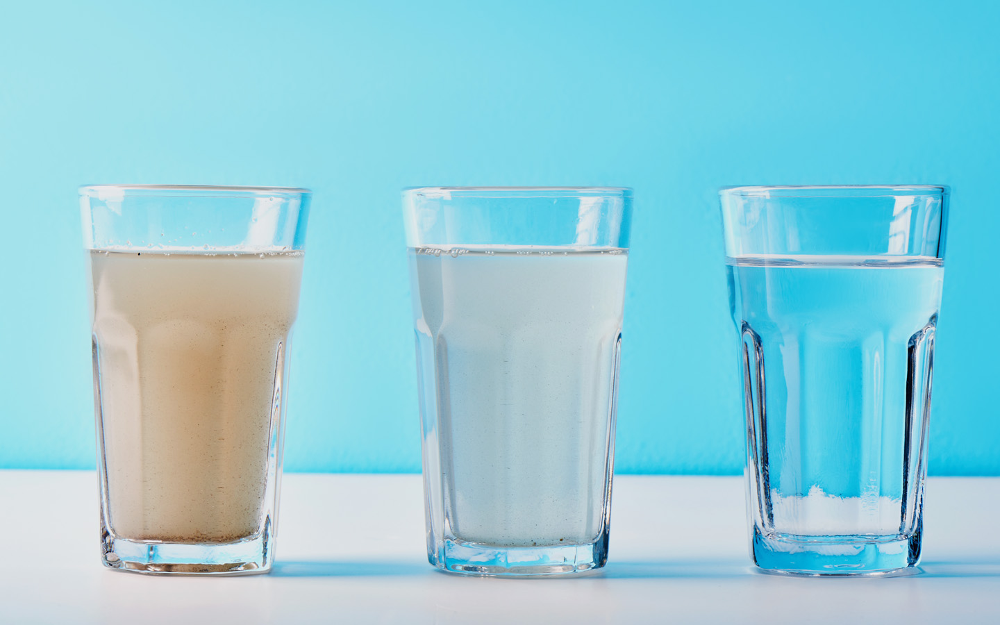

# Pure Aqua Website

The **Pure Aqua Website** is a project designed to promote awareness about clean water and sanitation, aligning with Sustainable Development Goal #6. The website includes multiple pages such as a home page, feedback page, content page, and a page editor, each showcasing various features and functionalities.

---

## Features

1. **Home Page**:
   - Displays the mission of the website.
   - Provides information about sustainable water management.
   - Styled using `homestyle.css`.

2. **Feedback Page**:
   - Allows users to submit feedback with a preview feature.
   - Includes a star rating system and optional fields for subject and category.
   - Functionality implemented using `feedbackjs.js` and styled with `feedbackstyle.css`.

3. **Content Page**:
   - Provides detailed information about water, its benefits, pollution, and purification methods.
   - Includes images and navigation links for easy access to sections.
   - Styled using `contentPageStyle.css`.

4. **Page Editor**:
   - Displays author details and links to other pages.
   - Styled using `pageEditorStyle.css`.

5. **Reusable Header and Footer**:
   - Common navigation and footer sections included in all pages.
   - Styled for consistency across the website.

---

## Technologies Used

- **HTML5**: For structuring the web pages.
- **CSS3**: For styling and layout.
- **JavaScript**: For interactive features like feedback preview and submission.
- **Font Awesome**: For icons in navigation and footer.

---

## How to Run

1. Clone the repository or download the project files.
2. Open any of the `.html` files (e.g., `HtmlPages/home.html`) in a web browser.
3. Ensure all linked resources (CSS, JavaScript, and images) are in the correct relative paths.

---

## Screenshots

### Home Page

### Feedback Page

### Content Page

---
